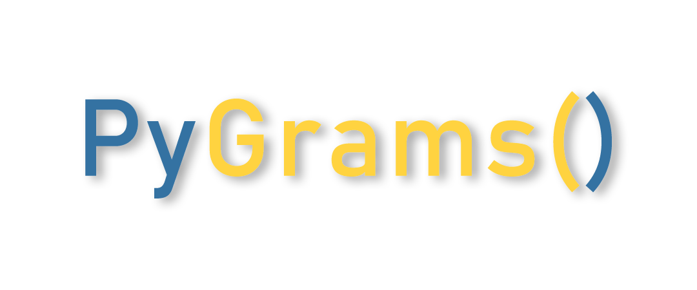

<p align="center">
  <a href="#">
    
  </a>
</p>

<h3 align="center">PyGrams</h3>

<p align="center">
  The Python Package to get all your hustling Programs in one CodeBase.
</p>

---

### 🚀 Quick Start

Several quick start options are available:

- [Download the latest release](https://github.com/Yaseen549/pygrams/archive/refs/tags/v0.0.16.zip)
- Clone the repo: `git clone https://github.com/Yaseen549/pygrams.git`
- Install via [PyPI](https://www.pypi.org/): `pip install pygrams`

For more information on the library contents, examples, and documentation, read the [Getting Started Guide](https://pygrams.netlify.app/).

---

### 📂 What's Included

Within the download, you'll find the following directories and files, logically grouping common assets. You'll see something like this:

```
pygrams/ 
├── src/ 
│   ├── pygrams.py  
│   └── ... 
├── README.md
└── LICENSE
```

This structure includes all the essential programs and supporting documentation files.

---

### 🐞 Bugs and Feature Requests

Have a bug or a feature request? Please first search for existing and closed [issues](https://github.com/Yaseen549/pygrams/issues). If your problem or idea is not addressed yet, [please open a new issue](https://github.com/Yaseen549/pygrams/issues/new).

**Is there any program missing?** [Raise an Issue here](https://github.com/Yaseen549/pygrams/issues/new).

---

### 🙌 Contribution Guide (Become a Backer)

If you are willing to contribute, follow these steps:

1. **Fork the Repo** to your GitHub account.
2. **Clone the Repo**: `git clone REPO_URL`
3. **Create a new remote** for the upstream repository: `git remote add upstream REPO_URL`
4. **Create a new branch**: `git checkout -b your-branch-name`
5. **Add your code**: `git add .`
6. **Commit your changes**: `git commit -m "Adding an awesome feature to your-branch-name"`
7. **Push the changes** to your repository: `git push -u origin your-branch-name`
8. **Create a pull request**: Submit a pull request, and we will review it ASAP!

That's it! Your name will appear in the contributors list once your PR is merged. 🎉

---

### 📢 Feature Request Process

If you'd like to request a feature, please follow the template below:

**Title**: Program Name

**Description**:
- Add a detailed explanation of how the function works.
- You can also include the complete program with comments explaining the logic and usage.

Click [here to request a feature](https://github.com/Yaseen549/pygrams/issues/new).

---

### 📝 License

This project is licensed under the MIT License - see the [LICENSE](LICENSE) file for details.

---

### 💬 Stay Connected

- [GitHub](https://github.com/Yaseen549)
- [Website](https://pygrams.netlify.app/)

---

Thank you for using PyGrams! Happy coding! 😊
